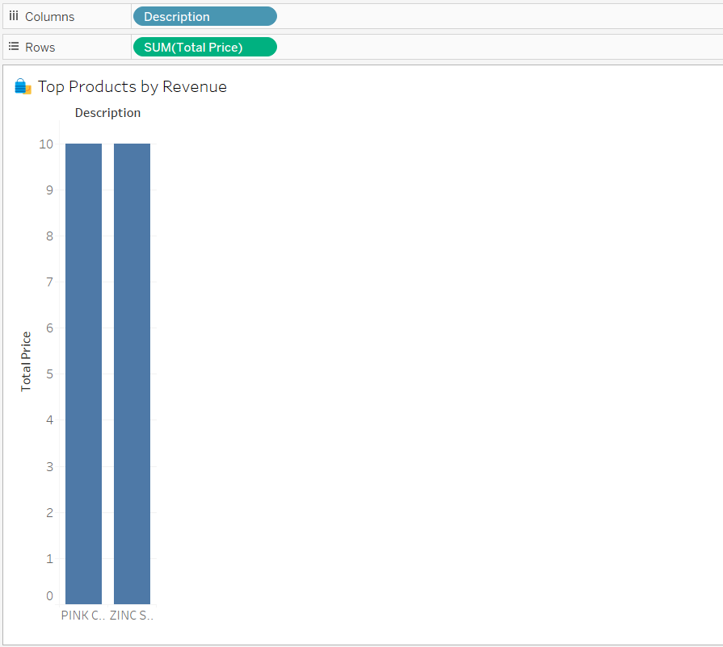
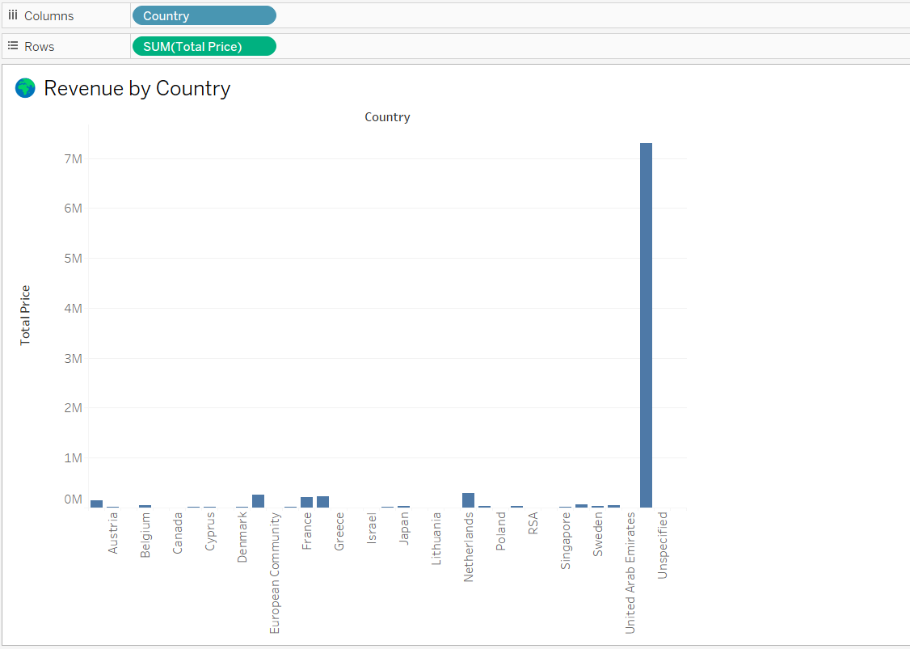
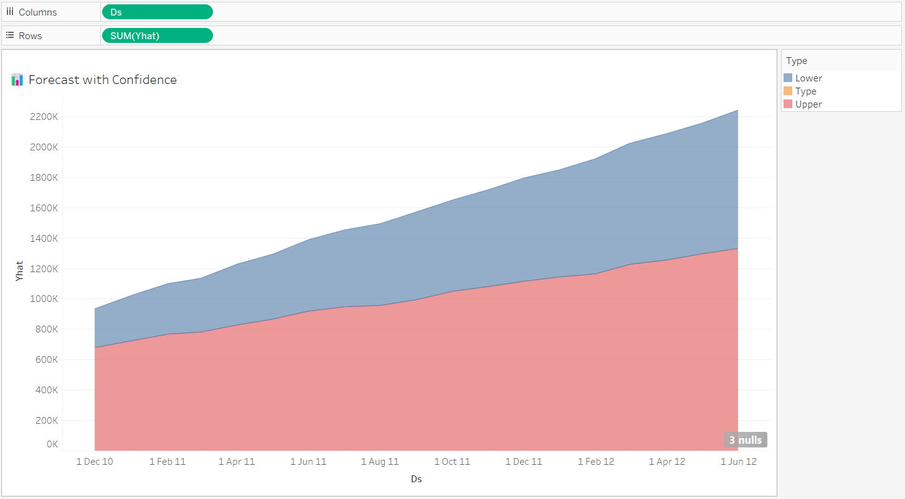

# 🛍️ Predictive Analytics for E-Commerce Sales

This project demonstrates end-to-end data analysis and forecasting using real-world e-commerce sales data. The goal is to analyze historical trends, predict future revenue, and visualize business insights through an interactive dashboard.

---

## 📌 Objective

To clean and explore a UK-based e-commerce dataset, forecast future monthly revenue using Facebook Prophet, and visualize the results in a Tableau dashboard for business decision-making.

---

## 🧰 Tools & Technologies Used

- Python (pandas, Prophet)
- Excel (forecast band preparation)
- Tableau Public (interactive dashboard)
- Streamlit (deployment)
- GitHub (version control and project hosting)

---

## 📂 Project Structure

ecommerce-sales-forecast/

├── app.py

├── sales_forecast.csv              ← Used in Streamlit

├── requirements.txt

├── notebooks/

│   └── ecommerce_forecasting_colab.ipynb

├── dashboard/

│   ├── forecast_bands.csv          ← Used in Tableau

│   ├── tableau_dashboard.twbx

│   ├── tableau_public_link.txt

│   ├── sheet1_sales_trend.png

│   ├── sheet2_top_products.png

│   ├── sheet3_country_revenue.png

│   ├── sheet4_forecast_band.png

├── README.md

---

## 🔍 Key Features

- Cleaned and processed over 500K transaction records
- Aggregated monthly revenue data
- Forecasted future sales using Prophet model
- Visualized insights with Tableau (top products, trends, forecasts)
- Confidence band chart created with Excel + Tableau
- Optional Streamlit web app to display results interactively

---

## 📂 Key Data Files

- `sales_forecast.csv` – Output of Prophet model used in Streamlit app
- `forecast_bands.csv` – Re-formatted forecast data used for Tableau confidence band

---

## 📈 Forecasting Approach

- Facebook Prophet used for time-series prediction
- Forecasted the next 6 months of revenue
- Confidence intervals included in final dashboard

---

## 📊 Tableau Dashboard

🔗 [View Live Dashboard on Tableau Public](https://public.tableau.com/app/profile/sravika.gillela/viz/Tableau_Dashboard_17499703450540/Dashboard1)

---

## 📸 Dashboard Preview

### 🔹 Forecast with Confidence Band

---

## 🧠 Insights Gained

- Revenue spikes around certain seasons and product categories
- Top-performing products and countries can be targeted for marketing
- Forecast allows for better inventory and budget planning

---

## ✅ Future Work

- Integrate product-level forecasting
- Build a full Streamlit front-end for user interaction
- Deploy as a full-stack app (Streamlit + Flask + Tableau Embed)

---

## 👤 Author

**Sravika Gillela**  
📫 sravika.gillela02@gmail.com  
🌐 [Tableau Public Profile](https://public.tableau.com/app/profile/sravika.gillela)
